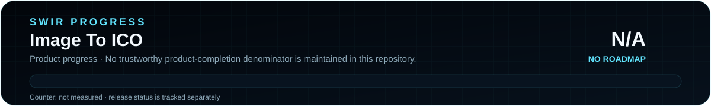

<!-- SWIR-README-STANDARD:v2 -->

<div align="center">


# Image To ICO

**Select an image. Preview it. Export a Windows icon.**


[](https://github.com/Swir)
[](https://github.com/Swir/Image-To-Ico/releases/tag/v1.0.0)
[](https://github.com/Swir/Image-To-Ico/stargazers)

[**Highlights**](#highlights) · [**Get started**](#quick-start) · [**Usage**](#usage) · [**Limitations**](#known-limitations) · [**Releases**](#releases-and-project-history)

</div>

---

## Project status

<p align="center">
  
</p>

| Item | Current state |
|---|---|
| Application | Existing Tkinter converter; use one source image at a time. |
| Published package | Windows x64 [`v1.0.0`](https://github.com/Swir/Image-To-Ico/releases/tag/v1.0.0). |
| Source check | PNG/JPG preview and single-image ICO export passed a bounded Linux/Xvfb smoke test. |
| Current limitation | Multiple-image export failed in that test; see [Known limitations](#known-limitations). |
| Product progress | **N/A** — no authoritative product-completion roadmap is maintained. |

<p align="center">
  
</p>

The progress graphics intentionally report **N/A**, not 0%, because this repository has no authoritative product-roadmap denominator. Release availability and the bounded source smoke are tracked separately.

The Windows EXE was not runtime-tested during this documentation update. Full test scope and environment: [verification notes](docs/README-VERIFICATION.md).

## Overview

**Image To ICO** is a small Python desktop utility for turning PNG or JPG images into `.ico` files. Image selection, a thumbnail and a save dialog share one compact window, without command-line conversion steps.

The application opens local files; there is no upload step in its source. Pillow provides the preview and imageio handles the export request. This is an icon-conversion utility, not a pixel editor or asset library.

## Highlights

| Feature | What it does |
|---|---|
| PNG / JPG input | Select `.png` and `.jpg` images through the file picker. |
| Image preview | Display the first added image in a thumbnail bounded to 100 × 100 pixels. |
| Add / remove | Add files and remove the most recently added file. |
| ICO save dialog | Select an output path; single-image export is the verified workflow. |
| Tkinter / ttk GUI | Work with a compact desktop interface. |
| Windows distribution | Existing EXE, portable ZIP and ZIP checksum in Releases. |

## Quick Start

### Existing Windows package

Download `Image-To-Ico-v1.0.0-Windows-x64.zip` from [release v1.0.0](https://github.com/Swir/Image-To-Ico/releases/tag/v1.0.0), extract it and launch `Image-To-Ico.exe`. Python is bundled by the existing PyInstaller build. A standalone EXE and the ZIP's `.sha256` sidecar are also available.

To compare the ZIP checksum in PowerShell:

```powershell
Get-FileHash .\Image-To-Ico-v1.0.0-Windows-x64.zip -Algorithm SHA256
Get-Content .\Image-To-Ico-v1.0.0-Windows-x64.zip.sha256
```

### From source — Windows PowerShell

Use Python with working Tkinter support:

```powershell
git clone https://github.com/Swir/Image-To-Ico.git
cd Image-To-Ico
python -m venv .venv
.\.venv\Scripts\python.exe -m pip install Pillow imageio
.\.venv\Scripts\python.exe -m tkinter
.\.venv\Scripts\python.exe ikona.py
```

Close the Tkinter test window before running the last command. Calling the virtual environment's Python directly avoids changing PowerShell activation policy.

**Installation caveat:** [`requirements.txt`](requirements.txt) currently contains a shell command, not a valid requirements list. Use the direct dependency installation above instead of `pip install -r requirements.txt`. Tkinter must be available in your Python installation.

<details>
<summary><strong>Other source environments</strong></summary>

With Python, Tkinter and a graphical display already available:

```bash
python3 -m venv .venv
.venv/bin/python -m pip install Pillow imageio
.venv/bin/python -m tkinter
.venv/bin/python ikona.py
```

A local Linux/Xvfb source check does not establish packaged Linux or macOS support.

</details>

## Requirements and compatibility

| Component | Scope |
|---|---|
| Python | Python 3; the Windows release workflow selects 3.11. |
| GUI | Tkinter / ttk and a graphical display. |
| Image libraries | Pillow for preview; imageio for image reading and export. |
| Published binary | Windows x64. |
| Tested source environment | Python 3.13.5, Tk 8.6.16, Pillow 12.3.0 and imageio 2.37.3 on Linux/Xvfb. |

The tested environment is an evidence snapshot, not a guarantee for every library version or input image. This documentation update does not change dependency versions.

## Usage

1. Choose **Add Image** and select one PNG or JPG. The first added image appears in the preview.
2. Choose **Convert to ICO**, select a destination and save. Check the resulting icon before using it in a build.
3. Use **Remove Image** to clear the previous selection, then add the next image.

There is no visible file-list selector. **Remove Image** deletes the last added file, while the preview shows the first remaining image. Selecting multiple images does not export a separate ICO per file.

## Technology and project layout

| Path | Purpose |
|---|---|
| [`ikona.py`](ikona.py) | Tkinter GUI, Pillow preview and imageio export. |
| [`requirements.txt`](requirements.txt) | Legacy dependency note; see the installation caveat. |
| [`.github/workflows/release.yml`](.github/workflows/release.yml) | Windows PyInstaller build and release packaging. |
| [`assets/readme/`](assets/readme/) | Documentation banner, project icon and SWIR Progress SVG PRO assets. |
| [`tools/generate_readme_progress.py`](tools/generate_readme_progress.py) | Deterministic progress-asset generator/check; product progress remains N/A until a real roadmap exists. |
| [`docs/README-VERIFICATION.md`](docs/README-VERIFICATION.md) | Source-check findings and documentation verification scope. |

## Releases and project history

The existing [v1.0.0 release](https://github.com/Swir/Image-To-Ico/releases/tag/v1.0.0) was published on September 12, 2026. Browse [all releases](https://github.com/Swir/Image-To-Ico/releases) or [source history](https://github.com/Swir/Image-To-Ico/commits/main/) for actual changes.

There is no dedicated roadmap in this checkout. This README migration and progress-SVG rollout change documentation and its artwork only: application code, versions, release assets and the existing EXE icon are unchanged.

## Known limitations

- **Multiple-image export:** two equal-size inputs produced `KeyError: 'ICO'` through the existing `imageio.mimsave` call with the tested versions. A single generated PNG or JPG exported and reopened successfully. No batch-per-file or animated-icon feature is claimed.
- **No output-size editor:** the GUI has no resolution selector, cropping, pixel editing or individual ICO-size controls.
- **Limited error handling:** save failures are reported in a dialog, but some image-reading and preview errors are outside that handler.
- **Scoped verification:** the source smoke used 64 × 64 RGB fixtures and a virtual Linux display, not arbitrary inputs or the Windows EXE. See the [test notes and reproduction](docs/README-VERIFICATION.md).

## License and attribution

Developed by **Swir**. No `LICENSE` file is currently included in this repository; this documentation update does not assign a new license or change attribution.

## 🔎 Search Keywords

`png to ico converter` • `jpg to ico converter` • `image to ico python` • `windows icon maker` • `ico converter gui` • `python icon generator` • `tkinter image converter` • `create ico file` • `desktop icon utility` • `Pillow image preview` • `imageio ICO export` • `local image conversion`

---

<div align="center">


### `SELECT • PREVIEW • EXPORT`

**Image To ICO — by Swir**

[**← SWIR profile**](https://github.com/Swir) · [**All projects →**](https://github.com/Swir?tab=repositories) · [**Report an issue**](https://github.com/Swir/Image-To-Ico/issues)

</div>
